# Sentiment-Driven Service Recovery Agent

A full-stack hospital operations app for post-discharge feedback, WhatsApp-based service recovery, ticketing, and weekly reporting.

## What It Does

The project tracks a patient recovery workflow from discharge to follow-up:

1. A patient is marked as `Paid` or `Discharged`.
2. The backend sends a WhatsApp feedback request.
3. The patient replies on WhatsApp.
4. Feedback is analyzed for sentiment, severity, category, and summary.
5. Negative feedback can create a ticket, notify the duty manager, and send a resolution message.
6. Positive feedback can trigger a thank-you follow-up.
7. The dashboard, feedback monitor, simulator, and analytics views reflect the latest state.

## Tech Stack

- Frontend: Next.js 16, React 19, TypeScript, MUI, Recharts
- Backend: FastAPI, Motor, WebSockets
- Database: MongoDB
- Messaging: Twilio WhatsApp
- AI: Google Gemini with local fallback when quota is unavailable

## Project Structure

```text
Sentiment-Driven-Service-Recovery--Agent-/
├── backend/
│   ├── main.py
│   ├── requirements.txt
│   ├── seed.py
│   ├── db/
│   ├── models/
│   ├── routes/
│   └── services/
├── frontend/
│   ├── app/
│   ├── components/
│   ├── lib/
│   └── public/
└── README.md
```

## Main Pages

- `/simulator`: Walk through the patient recovery workflow
- `/dashboard`: Live operational summary
- `/feedback`: Feedback records, summaries, sentiment, and response text
- `/tickets`: Complaint ticket tracking
- `/heatmap`: Department-level issue concentration
- `/analytics`: Weekly report and recommended actions
- `/notifications`: Manager alert feed

## Workflow Walkthrough

This is the main service recovery flow shown in the simulator and the WhatsApp conversation.

### 1. Start the recovery workflow

The simulator begins by selecting a patient and marking billing as complete so the discharge workflow can start.

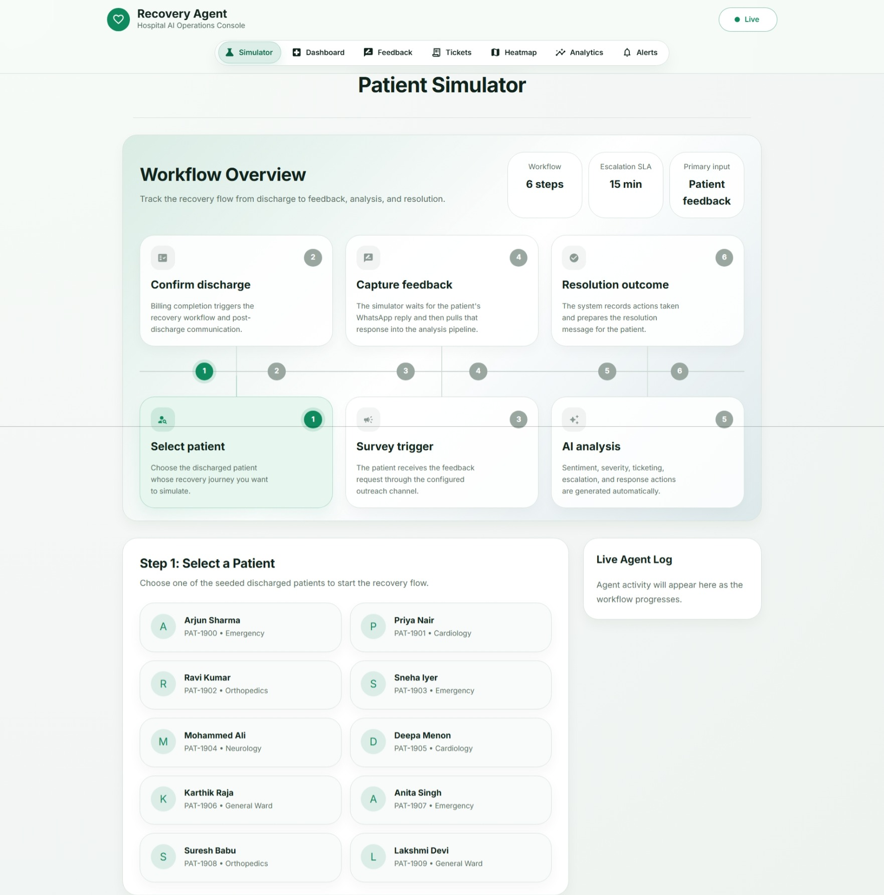

### 2. Track workflow progress

The simulator then follows the patient journey through feedback capture, AI analysis, ticketing, escalation, and resolution.

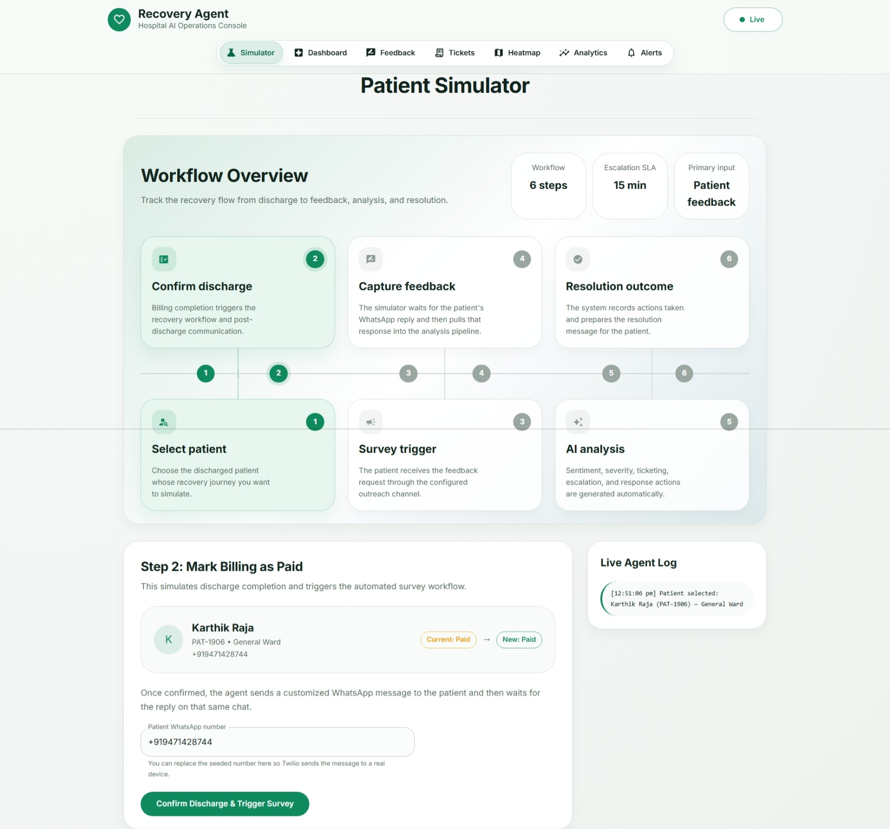

### 3. Review the final outcome

Once the patient responds, the system records the result, creates operational actions when needed, and shows the completed workflow state.

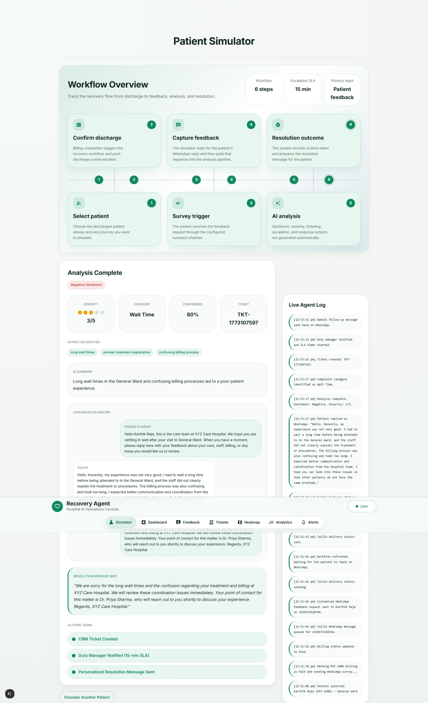

### 4. Negative feedback path on WhatsApp

For a negative response, the system analyzes the complaint, creates a ticket when appropriate, alerts the manager, and sends a resolution message back to the patient.

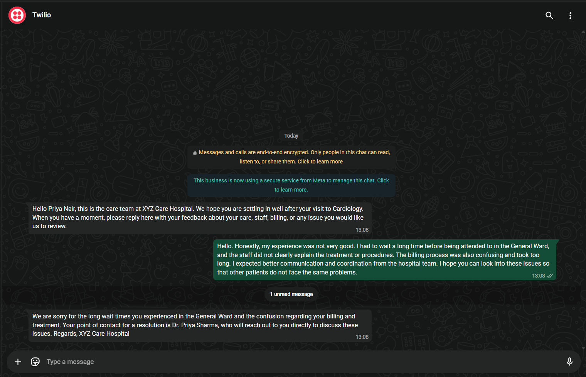

### 5. Positive feedback path on WhatsApp

For a positive response, the system keeps the flow lightweight and sends a thank-you follow-up instead of a complaint-resolution path.

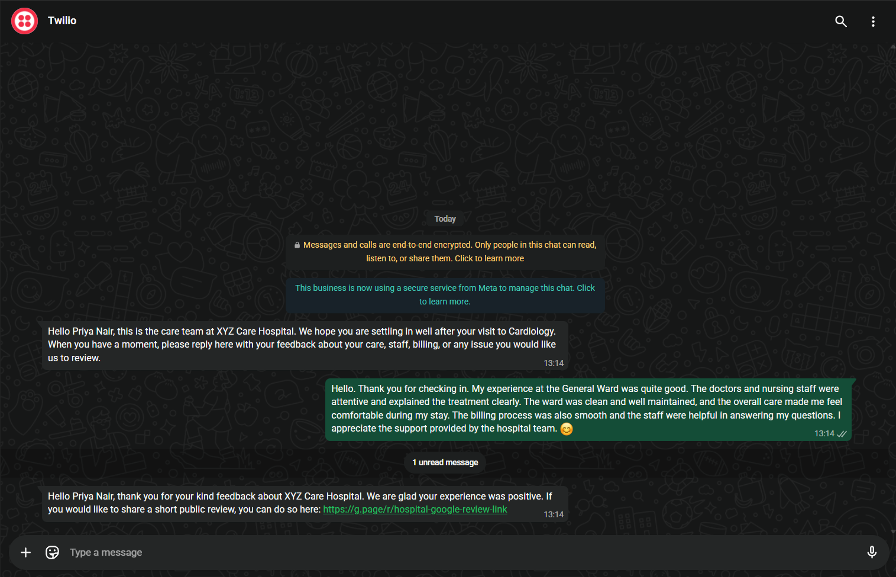

## Screenshots By Tab

### Simulator


### Dashboard

The dashboard gives a live operational summary of feedback volume, open tickets, critical alerts, and severity trends.

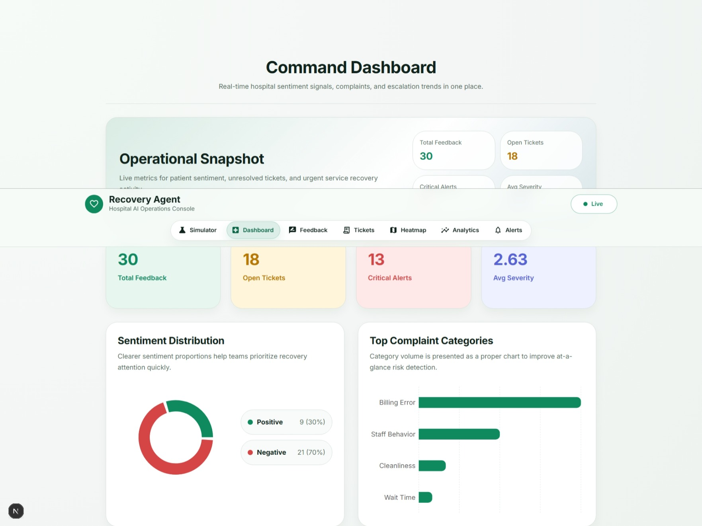

### Feedback

The feedback tab shows each patient response with the analyzed summary, sentiment, severity, category, and the generated follow-up message.

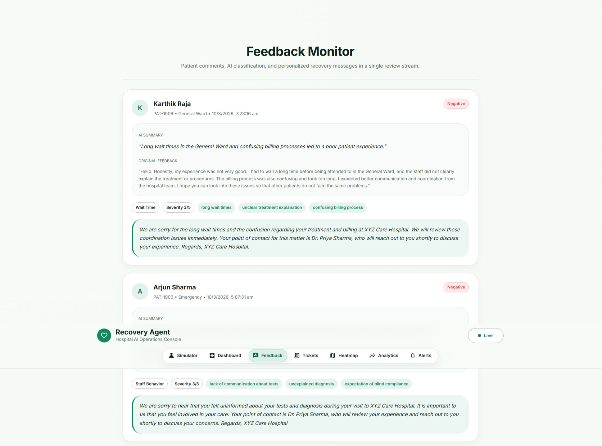

### Tickets

The tickets tab is used to track complaint cases that need follow-up and operational resolution.

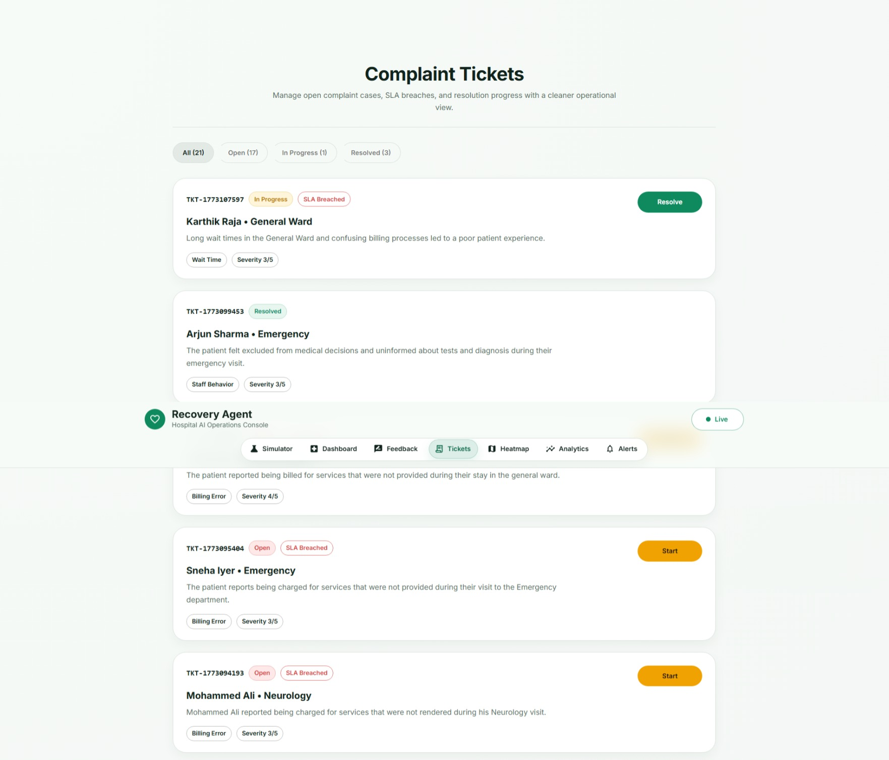

### Heatmap

The heatmap view highlights departments with higher complaint concentration and risk patterns.

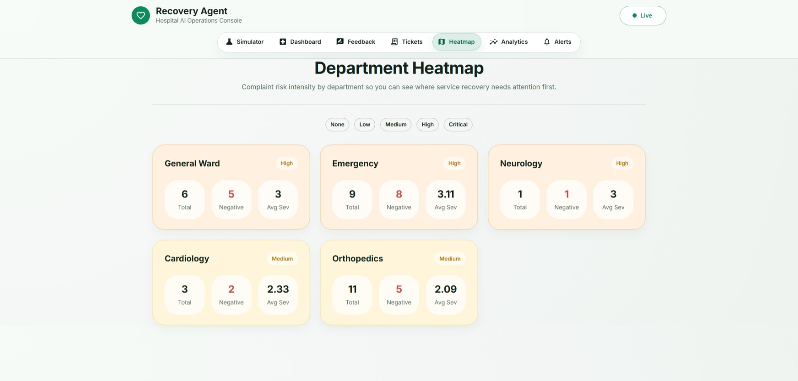

### Analytics

The analytics tab generates the weekly report, highlights overall insight, and lists recommended actions for leadership.

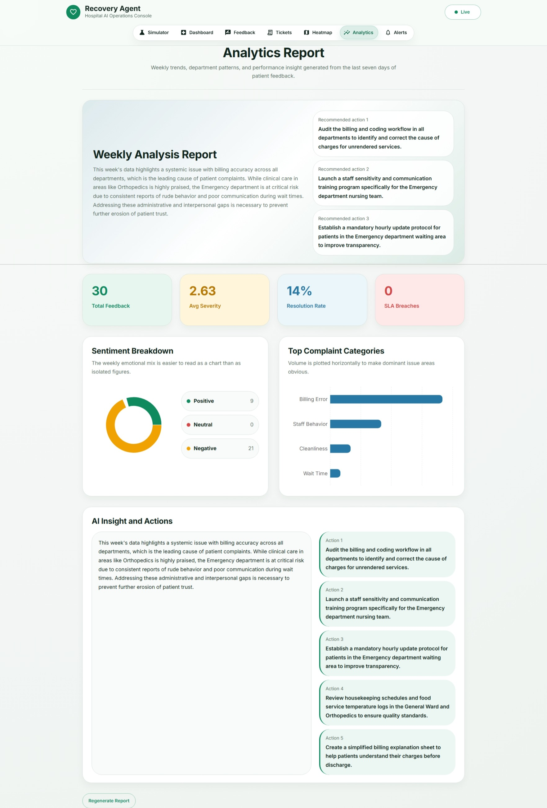

### Alerts

The alerts tab shows manager-facing notifications triggered by serious complaints and escalation events.

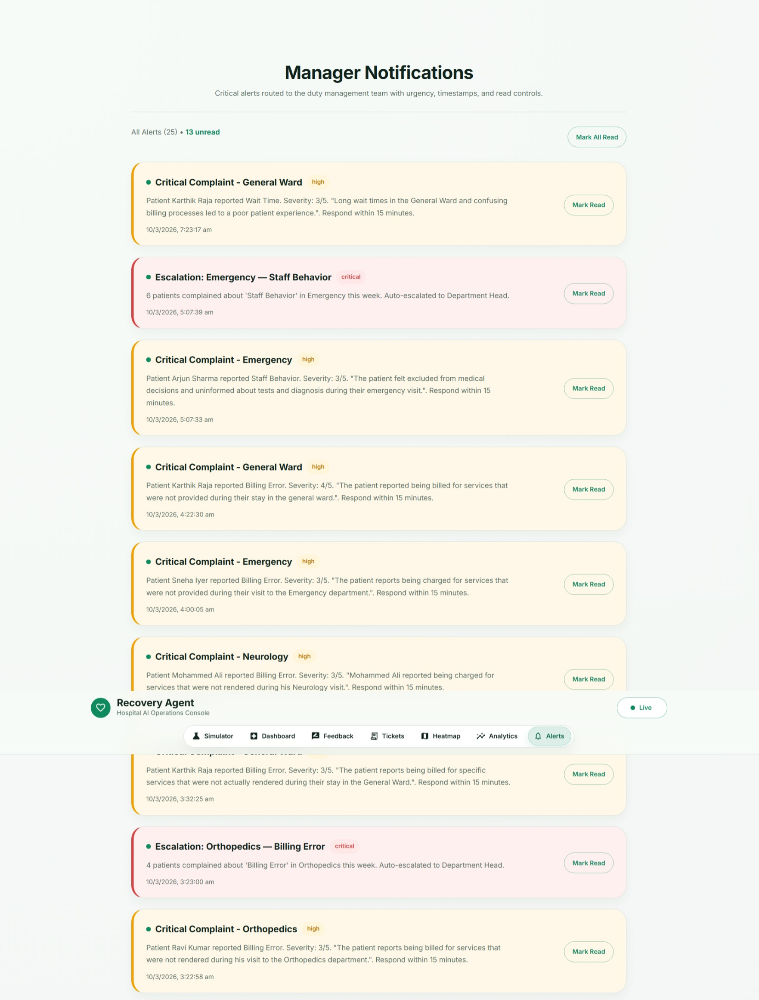

## Backend API

Main backend routes:

- `/api/patients`
- `/api/feedback`
- `/api/tickets`
- `/api/notifications`
- `/api/analytics`
- `/api/heatmap`
- `/api/whatsapp`
- `/ws` for live updates

## Environment Variables

Create `backend/.env` with at least:

```env
MONGO_URI=mongodb://localhost:27017
MONGO_DB_NAME=recovery_agent
GEMINI_API_KEY=your_gemini_key
TWILIO_ACCOUNT_SID=your_twilio_sid
TWILIO_AUTH_TOKEN=your_twilio_token
TWILIO_WHATSAPP_FROM=whatsapp:+14155238886
HOSPITAL_NAME=Your Hospital Name
```

## Local Setup

### Backend

```bash
cd backend
pip install -r requirements.txt
python seed.py
uvicorn main:app --host 0.0.0.0 --port 8000 --reload
```

Backend will run on `http://localhost:8000`.

### Frontend

```bash
cd frontend
npm install
npm run dev
```

Frontend will run on `http://localhost:3000`.

## Notes

- Twilio status callbacks are handled through `/api/whatsapp/status`.
- Incoming WhatsApp replies are processed through `/api/whatsapp/webhook`.
- If Gemini quota is exhausted, the backend falls back to local heuristic analysis so the workflow does not fail.
- The frontend build check is:

```bash
cd frontend
npm run build
```
